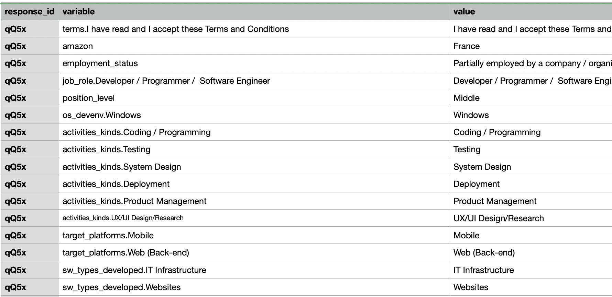
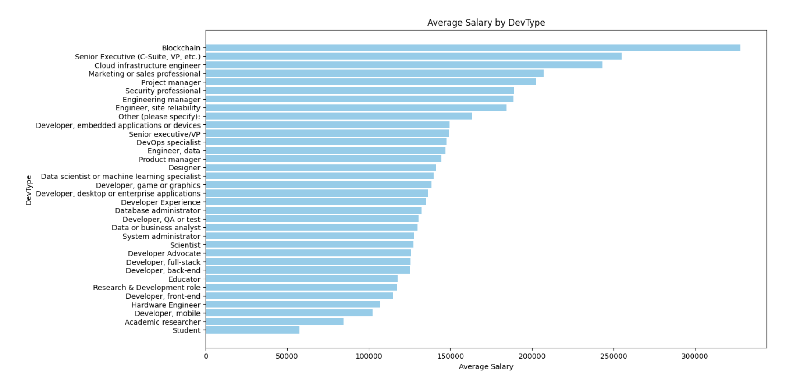
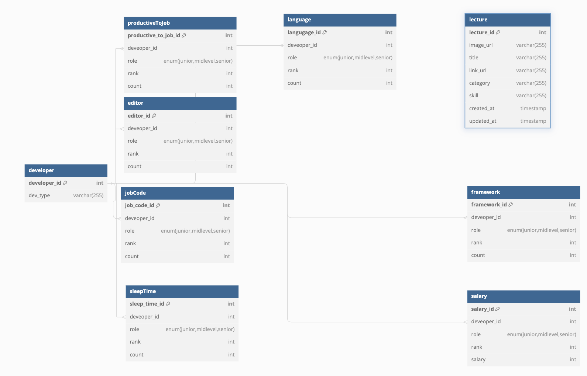
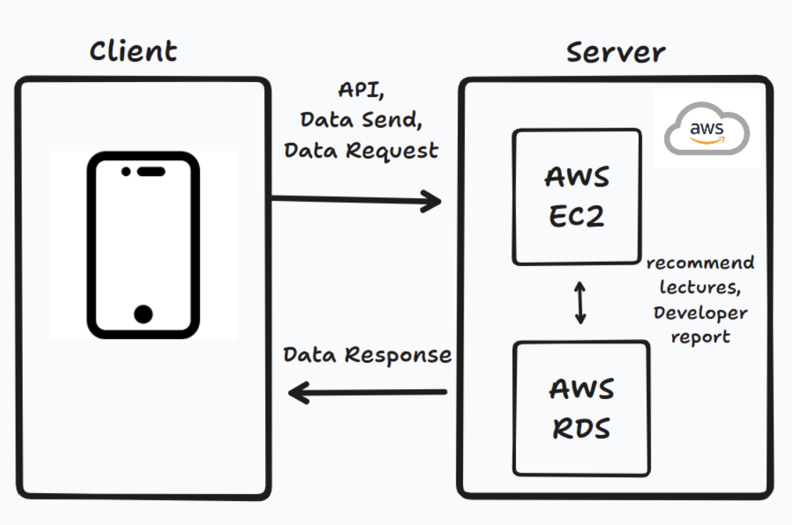

# To Be Develpers

## Project
해당 프로젝트는 개발자가 되고 싶어하는 사람들을 위해서 현 개발자들이 어떤 기술, 툴을 사용하며 관심을 가지는지 이외에도 현업에서의 생활습관(코드작성에 투자하는 시간, 수면시간, 개인 공부 시간) 등에 대한 데이터 자료를 기반하여 개발자 직종 및 연차(주니어, 미들, 시니어) 단위로 정보를 제공한다.

## Project Envirionment
### Frone-End
- Flutter
- Dart

### Back-End
- Node.js
- Javascript
- MySql

### Data
- Python
- Spark
- HDFS

### Coummunication Tools
- Slack
  - Daily Scrum 및 작업결과 공유
- Notion
  - 기획 및 회의 내용 정리
- GitHub
  - 소스 코드 관리
- Google Meet
  - 온라인 회의시 사용

## Members
- 강병호
  - PO, Scrum Master, Data
  - Data Procesing about Jetbrain and Combine
- 김성욱
  - Front-End
  - Develop Flutter App
- 이정운
  - Data
  - Data Processing about StackOverFlow
- 천현우
  - Back-End
  - Develop Node.js Server
- YINHE
  - Data
  - Crawling Infrean & Udemy Courses
## Data Processing (1.4 GB)
### Data Acquision
1. Stack Over Flow 설문조사 정보 raw data([Link](https://survey.stackoverflow.co/)) - 832MB
2. Jetbrain 설문조사 정보 raw data ([Link](https://drive.google.com/drive/folders/1nlvy45tE4gFX_oWNxG_UTC1-tLZBTcbR)) - 633MB
3. Infrean 강의 정보 ([Link](https://www.inflearn.com/courses)) 2MB
4. Udemy 강의 정보 ([Link](https://www.udemy.com/?utm_source=adwords-brand&utm_medium=udemyads&utm_campaign=Brand-Udemy_la.EN_cc.KR&campaigntype=Search&portfolio=BrandDirect&language=EN&product=Course&test=&audience=Keyword&topic=&priority=&utm_content=deal4584&utm_term=_._ag_129720831036_._ad_560391857160_._kw_udemy_._de_c_._dm__._pl__._ti_kwd-30719151476_._li_1009893_._pd__._&matchtype=b&gad_source=1&gclid=Cj0KCQjw97SzBhDaARIsAFHXUWAMgtySYAzYA08uhkEX-ZLIIgUmdctJepmH4tU_v9yNh-ZrJQ16hKEaAvaoEALw_wcB)) - 18MB

### Data Storing
해당 데이터 HDFS에 저장 및 분석 데이터 csv import 
### Data Analysis

우선 프로덕트에서 제공해야할 개발자의 직종을 분류하였습니다.

1. StackoverFlow  
  18년도부터 23년도 까지의 결과를 사용하였는데 설문조사지의 변경으로 인한 column명의 차이가 존재하였기에 동일한 의미를 지니는 컬럼을 찾아 최신의 컬럼명으로 변환하는 과정을 수행하였습니다. 
  이후 연차를 0~3(Junior), 3~7(Mid-level), 7~(Senior)의 기준으로 나누어서 데이터를 Grouping하였습니다.
2. Jetbrain  
  1번에서의 자료보다 다양한 기관의 설문조사 데이터를 통해 정확도를 높이고자 StackoverFlow 분석 이후 추가적으로 해당 raw data를 분석하였습니다.  
  column들의 경우 `{설문조사주제}.{설문조사 응답}` 과 같은 식으로 구성된 채로 columns의 수가 약 4000개를 가진 raw data 한 개와 기획단계에서 필요했던 `수면시간`, `코드 투자 시간`, `개인 공부 시간`, `일에 도움을 주는 것들`에 대한 내용은 또 다른 csv파일에서 제공하였습니다.
  
  
   
  병합된 정보에서 위의 StackOver Flow에 일치시키기 위해 다음의 과정을 통해 직종 데이터를 변환하였습니다.
  // 사진
3. Combining
  1, 2에서 생성된 직종 및 연차 별 csv파일을 통해 일치하는 정보를 기준으로 데이터를 합칩니다.
4. Infrean, Udemy 강의 정보
  개발자 직종에 일치하게 강의 데이터를 제공해주어야 하기에 분야를 식별할 수 있는 category 정보를 포함하여 crwaling을 진행합니다.
### Data Visualization

## API
**GET /devs/report** 
- 개발자의 타입 및 연차에 따른 분석 결과를 보고서 형식으로 제공 (연봉, 많이 사용하는 개발 언어, 프레임 워크 등)

**GET /lectures/recommend**
- 서비스 메인페이지 접속 시 개발과 관련된 강의 랜덤으로 추천
## ERD

## System Architecture
